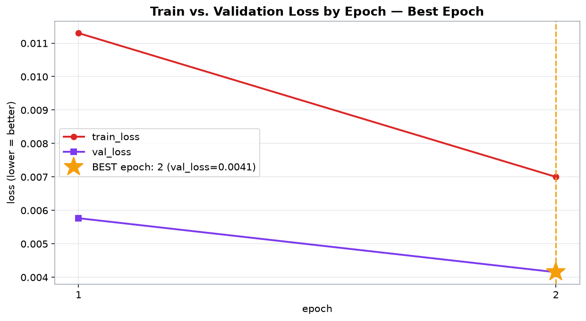
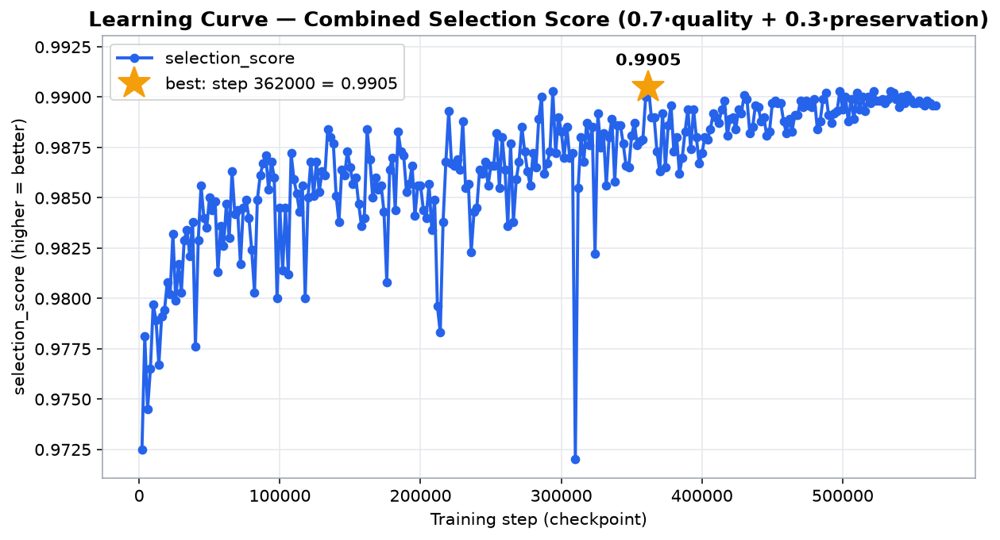
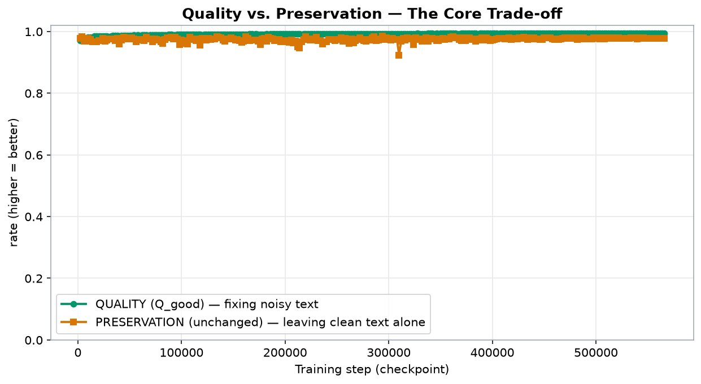
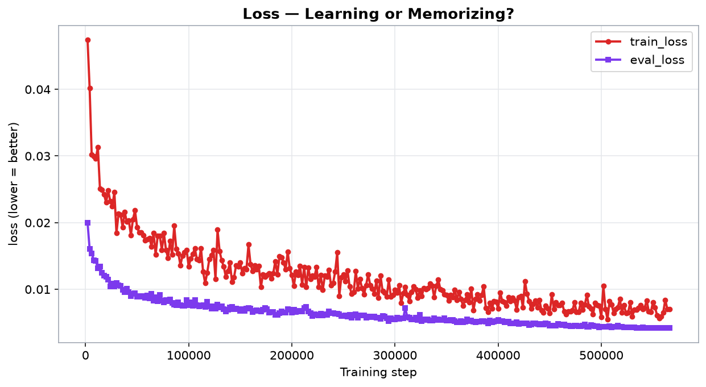
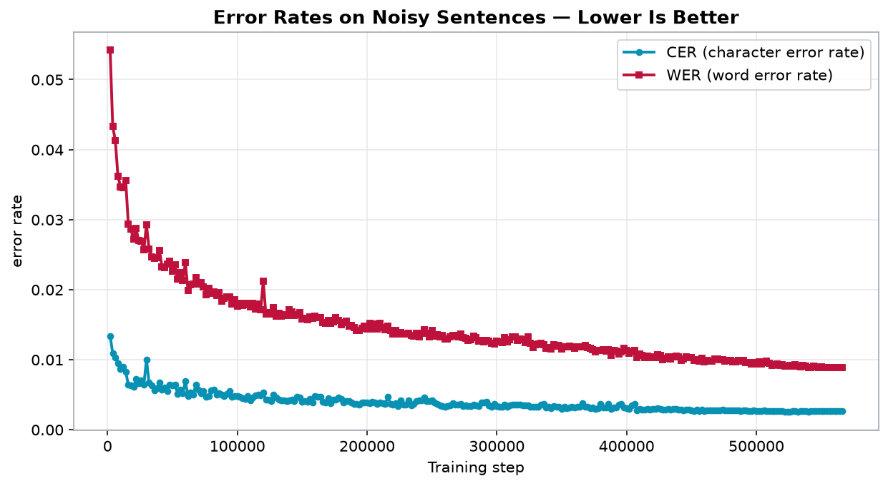
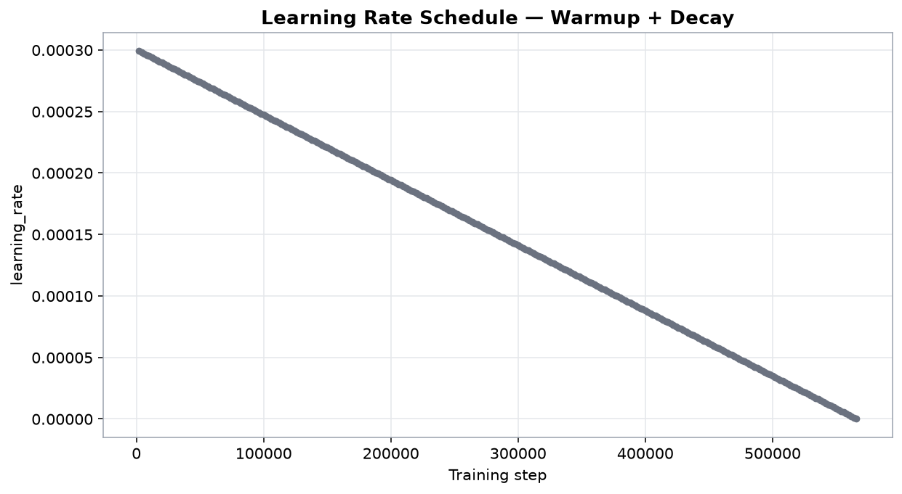
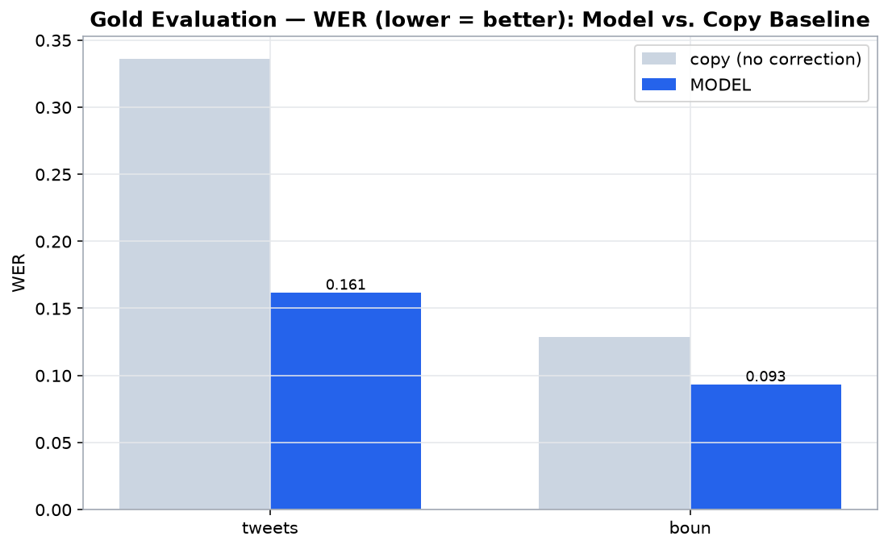
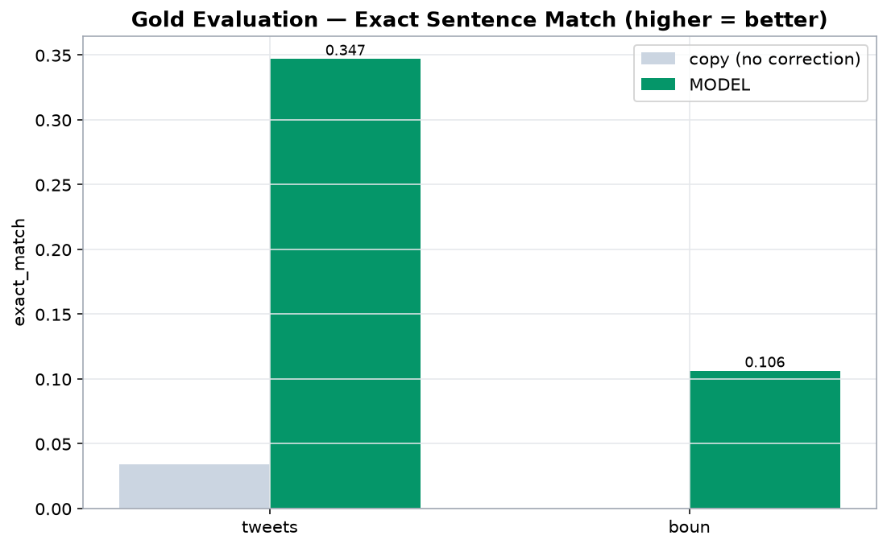

# Training Report — byT5-small Turkish Normalizer

## Summary

| field | value |
| --- | --- |
| Model | google/byt5-small |
| Device | cuda |
| Date | 2026-09-08 08:16:54 |
| Training sentences | 4,528,207 |
| Eval noisy (quality) | 3000 |
| Eval clean (preservation) | 3000 |
| Batch | 16 |
| Epoch | 2.0 |
| Learning rate | 0.0003 |
| Seed | 42 |
| Selection weight w (quality) | 0.7 |
| Total steps | 566026 |
| Total duration (min) | 5190.28 |

## Charts

### Train vs. val loss by epoch (best epoch)

### Learning curve (selection score)

### Quality vs. preservation trade-off

### Loss (per step, train vs. eval)

### CER & WER

### Learning rate schedule

### Gold evaluation — WER (model vs. copy)

### Gold evaluation — exact match (model vs. copy)

## Top 3 Checkpoints

| rank | step | selection_score |
| --- | --- | --- |
| 1 | 362000 | 0.9905 |
| 2 | 294000 | 0.9903 |
| 3 | 498000 | 0.9903 |

## All Checkpoints

> ★ = top 3 checkpoints by combined selection score

| ★ | step | epoch | examples | train_loss | eval_loss | CER | WER | Q_good | unchanged | selection |
| --- | --- | --- | --- | --- | --- | --- | --- | --- | --- | --- |
|  | 2000 | 0.0071 | 32000 | 0.0474 | 0.019981389865279198 | 0.0134 | 0.0542 | 0.9703 | 0.9777 | 0.9725 |
|  | 4000 | 0.0141 | 64000 | 0.0402 | 0.016045063734054565 | 0.0109 | 0.0433 | 0.9761 | 0.9827 | 0.9781 |
|  | 6000 | 0.0212 | 96000 | 0.0302 | 0.015398040413856506 | 0.0103 | 0.0413 | 0.9773 | 0.968 | 0.9745 |
|  | 8000 | 0.0283 | 128000 | 0.0299 | 0.014356815256178379 | 0.0095 | 0.0362 | 0.9798 | 0.9687 | 0.9765 |
|  | 10000 | 0.0353 | 160000 | 0.0296 | 0.01421825960278511 | 0.0087 | 0.0347 | 0.9809 | 0.977 | 0.9797 |
|  | 12000 | 0.0424 | 192000 | 0.0313 | 0.013164855539798737 | 0.009 | 0.0346 | 0.9808 | 0.9747 | 0.9789 |
|  | 14000 | 0.0495 | 224000 | 0.0251 | 0.013394223526120186 | 0.0083 | 0.0356 | 0.9808 | 0.967 | 0.9767 |
|  | 16000 | 0.0565 | 256000 | 0.0249 | 0.01246839389204979 | 0.0064 | 0.0294 | 0.9844 | 0.9667 | 0.9791 |
|  | 18000 | 0.0636 | 288000 | 0.0242 | 0.01205859612673521 | 0.0063 | 0.0286 | 0.9848 | 0.967 | 0.9794 |
|  | 20000 | 0.0707 | 320000 | 0.023 | 0.01185986865311861 | 0.0061 | 0.0272 | 0.9855 | 0.97 | 0.9808 |
|  | 22000 | 0.0777 | 352000 | 0.0248 | 0.011404146440327168 | 0.0072 | 0.0287 | 0.9842 | 0.971 | 0.9802 |
|  | 24000 | 0.0848 | 384000 | 0.0232 | 0.010450485162436962 | 0.0066 | 0.027 | 0.9852 | 0.9783 | 0.9832 |
|  | 26000 | 0.0919 | 416000 | 0.0224 | 0.010854355059564114 | 0.007 | 0.0269 | 0.9851 | 0.968 | 0.9799 |
|  | 28000 | 0.0989 | 448000 | 0.0246 | 0.010411636903882027 | 0.0064 | 0.0257 | 0.9859 | 0.972 | 0.9817 |
|  | 30000 | 0.106 | 480000 | 0.0184 | 0.010946360416710377 | 0.01 | 0.0293 | 0.9823 | 0.9757 | 0.9803 |
|  | 32000 | 0.1131 | 512000 | 0.0213 | 0.010624360293149948 | 0.0067 | 0.0258 | 0.9857 | 0.9763 | 0.9829 |
|  | 34000 | 0.1201 | 544000 | 0.0212 | 0.010519511066377163 | 0.0063 | 0.0247 | 0.9863 | 0.9767 | 0.9834 |
|  | 36000 | 0.1272 | 576000 | 0.0193 | 0.009889958426356316 | 0.0056 | 0.0245 | 0.9869 | 0.971 | 0.9821 |
|  | 38000 | 0.1343 | 608000 | 0.0216 | 0.009520089253783226 | 0.0059 | 0.0246 | 0.9866 | 0.977 | 0.9838 |
|  | 40000 | 0.1413 | 640000 | 0.0201 | 0.010060057044029236 | 0.0067 | 0.0256 | 0.9857 | 0.9587 | 0.9776 |
|  | 42000 | 0.1484 | 672000 | 0.0203 | 0.009580827318131924 | 0.0057 | 0.0232 | 0.9873 | 0.9727 | 0.9829 |
|  | 44000 | 0.1555 | 704000 | 0.0181 | 0.00900700967758894 | 0.006 | 0.0231 | 0.9872 | 0.982 | 0.9856 |
|  | 46000 | 0.1625 | 736000 | 0.0205 | 0.009277886711061 | 0.0055 | 0.0236 | 0.9872 | 0.9763 | 0.984 |
|  | 48000 | 0.1696 | 768000 | 0.0218 | 0.009361598640680313 | 0.0064 | 0.0241 | 0.9865 | 0.9763 | 0.9835 |
|  | 50000 | 0.1767 | 800000 | 0.0193 | 0.008875811472535133 | 0.0063 | 0.0226 | 0.9872 | 0.98 | 0.985 |
|  | 52000 | 0.1837 | 832000 | 0.0185 | 0.008922906592488289 | 0.0064 | 0.0235 | 0.9868 | 0.979 | 0.9844 |
|  | 54000 | 0.1908 | 864000 | 0.0185 | 0.008864354342222214 | 0.0051 | 0.0215 | 0.9883 | 0.9767 | 0.9848 |
|  | 56000 | 0.1979 | 896000 | 0.0181 | 0.008967638947069645 | 0.0057 | 0.0224 | 0.9876 | 0.9667 | 0.9813 |
|  | 58000 | 0.2049 | 928000 | 0.0173 | 0.008745640516281128 | 0.0052 | 0.0213 | 0.9884 | 0.9723 | 0.9836 |
|  | 60000 | 0.212 | 960000 | 0.0175 | 0.00906870886683464 | 0.0069 | 0.0238 | 0.9863 | 0.974 | 0.9826 |
|  | 62000 | 0.2191 | 992000 | 0.0177 | 0.008609864860773087 | 0.0048 | 0.0199 | 0.9891 | 0.9743 | 0.9847 |
|  | 64000 | 0.2261 | 1024000 | 0.0164 | 0.009287058375775814 | 0.0053 | 0.0207 | 0.9885 | 0.97 | 0.983 |
|  | 66000 | 0.2332 | 1056000 | 0.0184 | 0.008312234655022621 | 0.005 | 0.0208 | 0.9887 | 0.9807 | 0.9863 |
|  | 68000 | 0.2403 | 1088000 | 0.0152 | 0.008780479431152344 | 0.0064 | 0.0217 | 0.9875 | 0.9763 | 0.9842 |
|  | 70000 | 0.2473 | 1120000 | 0.018 | 0.008232754655182362 | 0.0057 | 0.0208 | 0.9882 | 0.9753 | 0.9844 |
|  | 72000 | 0.2544 | 1152000 | 0.018 | 0.00911875069141388 | 0.0052 | 0.021 | 0.9885 | 0.966 | 0.9817 |
|  | 74000 | 0.2615 | 1184000 | 0.0159 | 0.008258350193500519 | 0.0055 | 0.0204 | 0.9885 | 0.975 | 0.9845 |
|  | 76000 | 0.2685 | 1216000 | 0.0184 | 0.008066746406257153 | 0.0047 | 0.0193 | 0.9894 | 0.9743 | 0.9849 |
|  | 78000 | 0.2756 | 1248000 | 0.0159 | 0.008372616022825241 | 0.0048 | 0.0202 | 0.989 | 0.9723 | 0.984 |
|  | 80000 | 0.2827 | 1280000 | 0.0147 | 0.008206969127058983 | 0.0056 | 0.0195 | 0.9889 | 0.9673 | 0.9824 |
|  | 82000 | 0.2897 | 1312000 | 0.0172 | 0.008465675637125969 | 0.0057 | 0.0197 | 0.9887 | 0.9607 | 0.9803 |
|  | 84000 | 0.2968 | 1344000 | 0.0152 | 0.007964866235852242 | 0.005 | 0.0192 | 0.9893 | 0.9747 | 0.9849 |
|  | 86000 | 0.3039 | 1376000 | 0.0195 | 0.007707265205681324 | 0.0052 | 0.0196 | 0.9891 | 0.9793 | 0.9861 |
|  | 88000 | 0.3109 | 1408000 | 0.016 | 0.007561702746897936 | 0.005 | 0.0183 | 0.9897 | 0.9797 | 0.9867 |
|  | 90000 | 0.318 | 1440000 | 0.0154 | 0.008020732551813126 | 0.0048 | 0.0188 | 0.9896 | 0.9813 | 0.9871 |
|  | 92000 | 0.3251 | 1472000 | 0.0136 | 0.007634754292666912 | 0.0051 | 0.019 | 0.9893 | 0.9763 | 0.9854 |
|  | 94000 | 0.3321 | 1504000 | 0.015 | 0.007543044630438089 | 0.0055 | 0.019 | 0.9891 | 0.9813 | 0.9868 |
|  | 96000 | 0.3392 | 1536000 | 0.0155 | 0.007509147748351097 | 0.0047 | 0.0179 | 0.99 | 0.9767 | 0.986 |
|  | 98000 | 0.3463 | 1568000 | 0.0159 | 0.008399374783039093 | 0.0048 | 0.0186 | 0.9897 | 0.9573 | 0.98 |
|  | 100000 | 0.3533 | 1600000 | 0.0134 | 0.007580866571515799 | 0.0048 | 0.0176 | 0.9901 | 0.9717 | 0.9845 |
|  | 102000 | 0.3604 | 1632000 | 0.0146 | 0.008063007146120071 | 0.0047 | 0.018 | 0.99 | 0.9613 | 0.9814 |
|  | 104000 | 0.3675 | 1664000 | 0.0153 | 0.007491856347769499 | 0.0045 | 0.0177 | 0.9902 | 0.971 | 0.9845 |
|  | 106000 | 0.3745 | 1696000 | 0.0161 | 0.008325561881065369 | 0.0044 | 0.018 | 0.9901 | 0.9603 | 0.9812 |
|  | 108000 | 0.3816 | 1728000 | 0.0145 | 0.007623481564223766 | 0.0048 | 0.0178 | 0.99 | 0.9807 | 0.9872 |
|  | 110000 | 0.3887 | 1760000 | 0.0143 | 0.007426334545016289 | 0.0042 | 0.0175 | 0.9905 | 0.9753 | 0.9859 |
|  | 112000 | 0.3957 | 1792000 | 0.0161 | 0.0075508663430809975 | 0.0046 | 0.018 | 0.99 | 0.974 | 0.9852 |
|  | 114000 | 0.4028 | 1824000 | 0.0126 | 0.007560938596725464 | 0.0049 | 0.0172 | 0.9902 | 0.9707 | 0.9843 |
|  | 116000 | 0.4099 | 1856000 | 0.0109 | 0.0073710232973098755 | 0.005 | 0.0179 | 0.9899 | 0.9757 | 0.9856 |
|  | 118000 | 0.4169 | 1888000 | 0.0125 | 0.008092807605862617 | 0.0049 | 0.0171 | 0.9902 | 0.956 | 0.98 |
|  | 120000 | 0.424 | 1920000 | 0.0145 | 0.007456363644450903 | 0.0053 | 0.0212 | 0.9883 | 0.9773 | 0.985 |
|  | 122000 | 0.4311 | 1952000 | 0.0151 | 0.007108567748218775 | 0.0043 | 0.0165 | 0.9908 | 0.9773 | 0.9868 |
|  | 124000 | 0.4381 | 1984000 | 0.0159 | 0.00741030927747488 | 0.0043 | 0.0167 | 0.9907 | 0.972 | 0.9851 |
|  | 126000 | 0.4452 | 2016000 | 0.0115 | 0.00709881354123354 | 0.0041 | 0.0165 | 0.9909 | 0.977 | 0.9868 |
|  | 128000 | 0.4523 | 2048000 | 0.0189 | 0.007670500315725803 | 0.005 | 0.0174 | 0.99 | 0.9743 | 0.9853 |
|  | 130000 | 0.4593 | 2080000 | 0.0157 | 0.007236492354422808 | 0.0046 | 0.0162 | 0.9907 | 0.976 | 0.9863 |
|  | 132000 | 0.4664 | 2112000 | 0.0143 | 0.007424566894769669 | 0.0043 | 0.0166 | 0.9908 | 0.9753 | 0.9861 |
|  | 134000 | 0.4735 | 2144000 | 0.0134 | 0.007003012113273144 | 0.0042 | 0.0162 | 0.991 | 0.9823 | 0.9884 |
|  | 136000 | 0.4805 | 2176000 | 0.0119 | 0.006674968637526035 | 0.0042 | 0.0164 | 0.9909 | 0.9813 | 0.988 |
|  | 138000 | 0.4876 | 2208000 | 0.0127 | 0.00695126224309206 | 0.0041 | 0.0163 | 0.991 | 0.98 | 0.9877 |
|  | 140000 | 0.4947 | 2240000 | 0.014 | 0.007288192864507437 | 0.0042 | 0.0171 | 0.9906 | 0.9723 | 0.9851 |
|  | 142000 | 0.5017 | 2272000 | 0.0111 | 0.007352318614721298 | 0.0043 | 0.0168 | 0.9907 | 0.9677 | 0.9838 |
|  | 144000 | 0.5088 | 2304000 | 0.0118 | 0.0070288474671542645 | 0.0041 | 0.0163 | 0.991 | 0.9757 | 0.9864 |
|  | 146000 | 0.5159 | 2336000 | 0.0136 | 0.007072719745337963 | 0.0047 | 0.0164 | 0.9906 | 0.9753 | 0.9861 |
|  | 148000 | 0.5229 | 2368000 | 0.0134 | 0.006998925469815731 | 0.0046 | 0.0167 | 0.9905 | 0.9797 | 0.9873 |
|  | 150000 | 0.53 | 2400000 | 0.014 | 0.006778694223612547 | 0.004 | 0.0158 | 0.9913 | 0.9753 | 0.9865 |
|  | 152000 | 0.5371 | 2432000 | 0.0124 | 0.006975891068577766 | 0.0041 | 0.0159 | 0.9912 | 0.973 | 0.9857 |
|  | 154000 | 0.5441 | 2464000 | 0.0131 | 0.006778695620596409 | 0.004 | 0.0157 | 0.9913 | 0.9737 | 0.986 |
|  | 156000 | 0.5512 | 2496000 | 0.013 | 0.007111610844731331 | 0.0044 | 0.0161 | 0.9909 | 0.9703 | 0.9847 |
|  | 158000 | 0.5583 | 2528000 | 0.0167 | 0.007163221947848797 | 0.0039 | 0.0159 | 0.9913 | 0.9657 | 0.9836 |
|  | 160000 | 0.5653 | 2560000 | 0.0137 | 0.0071090455166995525 | 0.0048 | 0.0162 | 0.9906 | 0.9687 | 0.984 |
|  | 162000 | 0.5724 | 2592000 | 0.0127 | 0.006605028640478849 | 0.0047 | 0.016 | 0.9908 | 0.9827 | 0.9884 |
|  | 164000 | 0.5795 | 2624000 | 0.0136 | 0.00673654256388545 | 0.0047 | 0.016 | 0.9908 | 0.9777 | 0.9869 |
|  | 166000 | 0.5865 | 2656000 | 0.013 | 0.006857165601104498 | 0.004 | 0.0153 | 0.9915 | 0.9697 | 0.985 |
|  | 168000 | 0.5936 | 2688000 | 0.0135 | 0.006719870027154684 | 0.0039 | 0.0152 | 0.9916 | 0.973 | 0.986 |
|  | 170000 | 0.6007 | 2720000 | 0.0103 | 0.006651145871728659 | 0.0045 | 0.0156 | 0.991 | 0.9723 | 0.9854 |
|  | 172000 | 0.6077 | 2752000 | 0.0122 | 0.006889652460813522 | 0.0038 | 0.0152 | 0.9916 | 0.9717 | 0.9856 |
|  | 174000 | 0.6148 | 2784000 | 0.0119 | 0.007182718720287085 | 0.0043 | 0.0154 | 0.9912 | 0.968 | 0.9843 |
|  | 176000 | 0.6219 | 2816000 | 0.0121 | 0.007026004604995251 | 0.0043 | 0.016 | 0.991 | 0.957 | 0.9808 |
|  | 178000 | 0.6289 | 2848000 | 0.0124 | 0.006511171348392963 | 0.0046 | 0.0156 | 0.991 | 0.9757 | 0.9864 |
|  | 180000 | 0.636 | 2880000 | 0.0116 | 0.0066057308577001095 | 0.0044 | 0.015 | 0.9913 | 0.977 | 0.987 |
|  | 182000 | 0.6431 | 2912000 | 0.0124 | 0.006616600789129734 | 0.0039 | 0.0153 | 0.9916 | 0.9677 | 0.9844 |
|  | 184000 | 0.6501 | 2944000 | 0.0142 | 0.006115196272730827 | 0.0041 | 0.0155 | 0.9914 | 0.9813 | 0.9883 |
|  | 186000 | 0.6572 | 2976000 | 0.0122 | 0.0061674704775214195 | 0.0041 | 0.0148 | 0.9916 | 0.9773 | 0.9873 |
|  | 188000 | 0.6643 | 3008000 | 0.0149 | 0.006420676130801439 | 0.0039 | 0.0149 | 0.9917 | 0.9763 | 0.9871 |
|  | 190000 | 0.6713 | 3040000 | 0.0148 | 0.006675345823168755 | 0.0037 | 0.0146 | 0.9919 | 0.9697 | 0.9853 |
|  | 192000 | 0.6784 | 3072000 | 0.014 | 0.006503778975456953 | 0.0037 | 0.0142 | 0.9921 | 0.971 | 0.9857 |
|  | 194000 | 0.6855 | 3104000 | 0.013 | 0.0064690615981817245 | 0.0036 | 0.0142 | 0.9922 | 0.9737 | 0.9866 |
|  | 196000 | 0.6925 | 3136000 | 0.0156 | 0.007001953199505806 | 0.0039 | 0.0145 | 0.9919 | 0.966 | 0.9841 |
|  | 198000 | 0.6996 | 3168000 | 0.0131 | 0.006901207379996777 | 0.0039 | 0.0148 | 0.9917 | 0.9713 | 0.9856 |
|  | 200000 | 0.7067 | 3200000 | 0.0121 | 0.006487141828984022 | 0.0039 | 0.0144 | 0.9919 | 0.971 | 0.9856 |
|  | 202000 | 0.7137 | 3232000 | 0.0105 | 0.006902626249939203 | 0.0038 | 0.0152 | 0.9917 | 0.9673 | 0.9844 |
|  | 204000 | 0.7208 | 3264000 | 0.0126 | 0.006577361840754747 | 0.004 | 0.0144 | 0.9919 | 0.9657 | 0.984 |
|  | 206000 | 0.7279 | 3296000 | 0.0121 | 0.00664855120703578 | 0.0039 | 0.0151 | 0.9916 | 0.972 | 0.9857 |
|  | 208000 | 0.7349 | 3328000 | 0.0135 | 0.006777655333280563 | 0.0037 | 0.0144 | 0.992 | 0.9633 | 0.9834 |
|  | 210000 | 0.742 | 3360000 | 0.0107 | 0.006697071250528097 | 0.0039 | 0.0152 | 0.9916 | 0.9693 | 0.9849 |
|  | 212000 | 0.7491 | 3392000 | 0.0133 | 0.007185752969235182 | 0.0038 | 0.0146 | 0.9919 | 0.951 | 0.9796 |
|  | 214000 | 0.7561 | 3424000 | 0.0103 | 0.007312520407140255 | 0.0037 | 0.0143 | 0.992 | 0.9463 | 0.9783 |
|  | 216000 | 0.7632 | 3456000 | 0.0132 | 0.006695183925330639 | 0.0047 | 0.0148 | 0.9913 | 0.9663 | 0.9838 |
|  | 218000 | 0.7703 | 3488000 | 0.0115 | 0.006447821389883757 | 0.0037 | 0.0142 | 0.9921 | 0.9743 | 0.9868 |
|  | 220000 | 0.7773 | 3520000 | 0.012 | 0.005987670738250017 | 0.0036 | 0.0137 | 0.9923 | 0.9823 | 0.9893 |
|  | 222000 | 0.7844 | 3552000 | 0.0119 | 0.006218825001269579 | 0.0038 | 0.0142 | 0.9921 | 0.9743 | 0.9867 |
|  | 224000 | 0.7915 | 3584000 | 0.0133 | 0.006173816509544849 | 0.0034 | 0.0137 | 0.9925 | 0.973 | 0.9866 |
|  | 226000 | 0.7985 | 3616000 | 0.0103 | 0.006024434231221676 | 0.0042 | 0.0139 | 0.9919 | 0.9753 | 0.9869 |
|  | 228000 | 0.8056 | 3648000 | 0.0121 | 0.006346490234136581 | 0.0036 | 0.0137 | 0.9924 | 0.9723 | 0.9864 |
|  | 230000 | 0.8127 | 3680000 | 0.0099 | 0.006066932808607817 | 0.0036 | 0.0137 | 0.9923 | 0.9807 | 0.9888 |
|  | 232000 | 0.8198 | 3712000 | 0.012 | 0.006203833036124706 | 0.0042 | 0.0138 | 0.992 | 0.9703 | 0.9855 |
|  | 234000 | 0.8268 | 3744000 | 0.0119 | 0.006167276296764612 | 0.0035 | 0.0135 | 0.9925 | 0.9697 | 0.9857 |
|  | 236000 | 0.8339 | 3776000 | 0.0129 | 0.006655153352767229 | 0.0037 | 0.0134 | 0.9924 | 0.9587 | 0.9823 |
|  | 238000 | 0.841 | 3808000 | 0.0106 | 0.006443387363106012 | 0.0041 | 0.0138 | 0.992 | 0.9663 | 0.9843 |
|  | 240000 | 0.848 | 3840000 | 0.0109 | 0.006367516703903675 | 0.0042 | 0.0133 | 0.9921 | 0.9667 | 0.9845 |
|  | 242000 | 0.8551 | 3872000 | 0.0126 | 0.0063364277593791485 | 0.0042 | 0.0138 | 0.9919 | 0.9733 | 0.9864 |
|  | 244000 | 0.8622 | 3904000 | 0.0155 | 0.00628126272931695 | 0.0046 | 0.0143 | 0.9915 | 0.9737 | 0.9862 |
|  | 246000 | 0.8692 | 3936000 | 0.009 | 0.006201606243848801 | 0.0041 | 0.0138 | 0.9921 | 0.9747 | 0.9868 |
|  | 248000 | 0.8763 | 3968000 | 0.0118 | 0.005995511543005705 | 0.0041 | 0.0132 | 0.9923 | 0.97 | 0.9856 |
|  | 250000 | 0.8834 | 4000000 | 0.0122 | 0.006012041587382555 | 0.0042 | 0.0142 | 0.9918 | 0.9743 | 0.9866 |
|  | 252000 | 0.8904 | 4032000 | 0.0112 | 0.006077668629586697 | 0.0039 | 0.0134 | 0.9923 | 0.9733 | 0.9866 |
|  | 254000 | 0.8975 | 4064000 | 0.0128 | 0.005885039456188679 | 0.0037 | 0.0136 | 0.9923 | 0.9787 | 0.9882 |
|  | 256000 | 0.9046 | 4096000 | 0.0104 | 0.006190072279423475 | 0.0035 | 0.0133 | 0.9925 | 0.969 | 0.9855 |
|  | 258000 | 0.9116 | 4128000 | 0.0093 | 0.005748465657234192 | 0.0034 | 0.0135 | 0.9925 | 0.9773 | 0.988 |
|  | 260000 | 0.9187 | 4160000 | 0.0096 | 0.006100854836404324 | 0.0033 | 0.0129 | 0.9928 | 0.9713 | 0.9864 |
|  | 262000 | 0.9258 | 4192000 | 0.0127 | 0.006197789683938026 | 0.0034 | 0.0129 | 0.9928 | 0.962 | 0.9836 |
|  | 264000 | 0.9328 | 4224000 | 0.0101 | 0.005722689907997847 | 0.0035 | 0.0133 | 0.9926 | 0.9763 | 0.9877 |
|  | 266000 | 0.9399 | 4256000 | 0.0115 | 0.006104508880525827 | 0.0038 | 0.0135 | 0.9923 | 0.964 | 0.9838 |
|  | 268000 | 0.947 | 4288000 | 0.0102 | 0.00605554087087512 | 0.0036 | 0.0135 | 0.9924 | 0.9707 | 0.9859 |
|  | 270000 | 0.954 | 4320000 | 0.0092 | 0.006038080435246229 | 0.0036 | 0.0132 | 0.9926 | 0.9733 | 0.9868 |
|  | 272000 | 0.9611 | 4352000 | 0.0106 | 0.005758996121585369 | 0.0037 | 0.0137 | 0.9923 | 0.9797 | 0.9885 |
|  | 274000 | 0.9682 | 4384000 | 0.0122 | 0.0058691976591944695 | 0.0034 | 0.0131 | 0.9927 | 0.9747 | 0.9873 |
|  | 276000 | 0.9752 | 4416000 | 0.0106 | 0.005906771402806044 | 0.0035 | 0.013 | 0.9927 | 0.9713 | 0.9863 |
|  | 278000 | 0.9823 | 4448000 | 0.0101 | 0.005781546235084534 | 0.0034 | 0.0127 | 0.9929 | 0.9687 | 0.9856 |
|  | 280000 | 0.9894 | 4480000 | 0.0093 | 0.005933030508458614 | 0.0034 | 0.0128 | 0.9928 | 0.974 | 0.9872 |
|  | 282000 | 0.9964 | 4512000 | 0.0113 | 0.0057644909247756 | 0.0036 | 0.0134 | 0.9925 | 0.9727 | 0.9865 |
|  | 284000 | 1.0035 | 4544000 | 0.0087 | 0.00574379600584507 | 0.0035 | 0.0131 | 0.9926 | 0.9803 | 0.9889 |
|  | 286000 | 1.0106 | 4576000 | 0.012 | 0.005546098109334707 | 0.0034 | 0.0126 | 0.9929 | 0.9833 | 0.99 |
|  | 288000 | 1.0176 | 4608000 | 0.0097 | 0.005952201783657074 | 0.0039 | 0.0127 | 0.9926 | 0.9713 | 0.9862 |
|  | 290000 | 1.0247 | 4640000 | 0.0095 | 0.005871753674000502 | 0.0039 | 0.0125 | 0.9926 | 0.9727 | 0.9867 |
|  | 292000 | 1.0318 | 4672000 | 0.0089 | 0.005620921961963177 | 0.004 | 0.0127 | 0.9925 | 0.975 | 0.9873 |
| ★ | 294000 | 1.0388 | 4704000 | 0.0114 | 0.005253201350569725 | 0.0035 | 0.0126 | 0.9929 | 0.9843 | 0.9903 |
|  | 296000 | 1.0459 | 4736000 | 0.0089 | 0.0056676617823541164 | 0.0033 | 0.0123 | 0.9931 | 0.9733 | 0.9872 |
|  | 298000 | 1.053 | 4768000 | 0.0091 | 0.00543173449113965 | 0.0037 | 0.0122 | 0.9929 | 0.98 | 0.989 |
|  | 300000 | 1.06 | 4800000 | 0.0099 | 0.005503456573933363 | 0.0034 | 0.0126 | 0.9929 | 0.9777 | 0.9883 |
|  | 302000 | 1.0671 | 4832000 | 0.0095 | 0.0057025789283216 | 0.0033 | 0.0125 | 0.993 | 0.973 | 0.987 |
|  | 304000 | 1.0742 | 4864000 | 0.0106 | 0.005589735694229603 | 0.0033 | 0.0124 | 0.9931 | 0.978 | 0.9885 |
|  | 306000 | 1.0812 | 4896000 | 0.0079 | 0.005670289508998394 | 0.0036 | 0.0131 | 0.9926 | 0.974 | 0.987 |
|  | 308000 | 1.0883 | 4928000 | 0.0094 | 0.005646182224154472 | 0.0033 | 0.0125 | 0.993 | 0.9737 | 0.9872 |
|  | 310000 | 1.0954 | 4960000 | 0.0103 | 0.007197486702352762 | 0.0035 | 0.0128 | 0.9928 | 0.9237 | 0.972 |
|  | 312000 | 1.1024 | 4992000 | 0.0091 | 0.005774055607616901 | 0.0036 | 0.0132 | 0.9926 | 0.969 | 0.9855 |
|  | 314000 | 1.1095 | 5024000 | 0.0082 | 0.005736714694648981 | 0.0036 | 0.0132 | 0.9926 | 0.9773 | 0.988 |
|  | 316000 | 1.1166 | 5056000 | 0.0096 | 0.005502456799149513 | 0.0036 | 0.0127 | 0.9927 | 0.973 | 0.9868 |
|  | 318000 | 1.1236 | 5088000 | 0.0104 | 0.005439409054815769 | 0.0036 | 0.0129 | 0.9927 | 0.9793 | 0.9887 |
|  | 320000 | 1.1307 | 5120000 | 0.01 | 0.005696258507668972 | 0.0035 | 0.0128 | 0.9928 | 0.9753 | 0.9876 |
|  | 322000 | 1.1378 | 5152000 | 0.0087 | 0.005411147605627775 | 0.0035 | 0.0124 | 0.9929 | 0.978 | 0.9885 |
|  | 324000 | 1.1448 | 5184000 | 0.0098 | 0.006117410026490688 | 0.0035 | 0.0132 | 0.9926 | 0.958 | 0.9822 |
|  | 326000 | 1.1519 | 5216000 | 0.009 | 0.005229556001722813 | 0.0033 | 0.0123 | 0.9931 | 0.98 | 0.9892 |
|  | 328000 | 1.159 | 5248000 | 0.0102 | 0.005434986669570208 | 0.0033 | 0.0117 | 0.9934 | 0.974 | 0.9875 |
|  | 330000 | 1.166 | 5280000 | 0.01 | 0.005421831272542477 | 0.0033 | 0.0121 | 0.9931 | 0.9767 | 0.9882 |
|  | 332000 | 1.1731 | 5312000 | 0.0102 | 0.005470920354127884 | 0.0033 | 0.0122 | 0.9931 | 0.968 | 0.9856 |
|  | 334000 | 1.1802 | 5344000 | 0.0108 | 0.005336359608918428 | 0.0036 | 0.0123 | 0.9929 | 0.9763 | 0.988 |
|  | 336000 | 1.1872 | 5376000 | 0.0105 | 0.005290805362164974 | 0.0037 | 0.0121 | 0.9929 | 0.9793 | 0.9889 |
|  | 338000 | 1.1943 | 5408000 | 0.0088 | 0.005676147527992725 | 0.0032 | 0.0116 | 0.9934 | 0.968 | 0.9858 |
|  | 340000 | 1.2014 | 5440000 | 0.0105 | 0.005367432255297899 | 0.0033 | 0.0117 | 0.9933 | 0.9777 | 0.9886 |
|  | 342000 | 1.2084 | 5472000 | 0.0114 | 0.005428347270935774 | 0.0031 | 0.0115 | 0.9935 | 0.977 | 0.9886 |
|  | 344000 | 1.2155 | 5504000 | 0.01 | 0.005396895110607147 | 0.0034 | 0.0121 | 0.9931 | 0.975 | 0.9877 |
|  | 346000 | 1.2226 | 5536000 | 0.0098 | 0.005394022446125746 | 0.0033 | 0.0119 | 0.9933 | 0.971 | 0.9866 |
|  | 348000 | 1.2296 | 5568000 | 0.0092 | 0.005616137757897377 | 0.0033 | 0.012 | 0.9932 | 0.971 | 0.9865 |
|  | 350000 | 1.2367 | 5600000 | 0.0091 | 0.005326320417225361 | 0.003 | 0.0115 | 0.9936 | 0.9753 | 0.9881 |
|  | 352000 | 1.2438 | 5632000 | 0.0083 | 0.0052588991820812225 | 0.0033 | 0.0118 | 0.9933 | 0.978 | 0.9887 |
|  | 354000 | 1.2508 | 5664000 | 0.0091 | 0.005392968654632568 | 0.0031 | 0.0118 | 0.9934 | 0.974 | 0.9876 |
|  | 356000 | 1.2579 | 5696000 | 0.0088 | 0.005396632477641106 | 0.0032 | 0.0119 | 0.9933 | 0.975 | 0.9878 |
|  | 358000 | 1.265 | 5728000 | 0.0099 | 0.005246197804808617 | 0.0033 | 0.0118 | 0.9933 | 0.9753 | 0.9879 |
|  | 360000 | 1.272 | 5760000 | 0.0084 | 0.00508113345131278 | 0.0032 | 0.0116 | 0.9934 | 0.982 | 0.99 |
| ★ | 362000 | 1.2791 | 5792000 | 0.0096 | 0.00501408101990819 | 0.0033 | 0.0118 | 0.9933 | 0.984 | 0.9905 |
|  | 364000 | 1.2862 | 5824000 | 0.0085 | 0.005216323770582676 | 0.0033 | 0.0118 | 0.9933 | 0.979 | 0.989 |
|  | 366000 | 1.2932 | 5856000 | 0.0075 | 0.005058562383055687 | 0.0038 | 0.0118 | 0.993 | 0.9797 | 0.989 |
|  | 368000 | 1.3003 | 5888000 | 0.0084 | 0.005165030714124441 | 0.0033 | 0.012 | 0.9932 | 0.9737 | 0.9873 |
|  | 370000 | 1.3074 | 5920000 | 0.0092 | 0.0055108643136918545 | 0.0033 | 0.0117 | 0.9934 | 0.9697 | 0.9863 |
|  | 372000 | 1.3144 | 5952000 | 0.008 | 0.0051766266115009785 | 0.0031 | 0.0116 | 0.9935 | 0.9793 | 0.9892 |
|  | 374000 | 1.3215 | 5984000 | 0.0101 | 0.005327480845153332 | 0.0032 | 0.0114 | 0.9935 | 0.97 | 0.9865 |
|  | 376000 | 1.3286 | 6016000 | 0.0068 | 0.005164299160242081 | 0.003 | 0.0111 | 0.9937 | 0.9767 | 0.9886 |
|  | 378000 | 1.3356 | 6048000 | 0.0085 | 0.005058236885815859 | 0.0031 | 0.0113 | 0.9936 | 0.9803 | 0.9896 |
|  | 380000 | 1.3427 | 6080000 | 0.0092 | 0.005147993098944426 | 0.0037 | 0.0113 | 0.9933 | 0.9733 | 0.9873 |
|  | 382000 | 1.3498 | 6112000 | 0.0083 | 0.0051546781323850155 | 0.0032 | 0.0114 | 0.9935 | 0.975 | 0.988 |
|  | 384000 | 1.3568 | 6144000 | 0.0091 | 0.005195464473217726 | 0.0032 | 0.0112 | 0.9936 | 0.969 | 0.9862 |
|  | 386000 | 1.3639 | 6176000 | 0.0104 | 0.00518424017354846 | 0.0037 | 0.0114 | 0.9932 | 0.9723 | 0.987 |
|  | 388000 | 1.371 | 6208000 | 0.0072 | 0.005117615219205618 | 0.003 | 0.0106 | 0.994 | 0.975 | 0.9883 |
|  | 390000 | 1.378 | 6240000 | 0.0066 | 0.00483020581305027 | 0.0032 | 0.0113 | 0.9936 | 0.9797 | 0.9894 |
|  | 392000 | 1.3851 | 6272000 | 0.0079 | 0.005318586248904467 | 0.0032 | 0.0112 | 0.9936 | 0.973 | 0.9874 |
|  | 394000 | 1.3922 | 6304000 | 0.0071 | 0.005009408108890057 | 0.0036 | 0.0108 | 0.9935 | 0.9797 | 0.9894 |
|  | 396000 | 1.3992 | 6336000 | 0.0082 | 0.005161867011338472 | 0.0037 | 0.0111 | 0.9933 | 0.9757 | 0.988 |
|  | 398000 | 1.4063 | 6368000 | 0.0081 | 0.005173875950276852 | 0.0032 | 0.0116 | 0.9934 | 0.971 | 0.9867 |
|  | 400000 | 1.4134 | 6400000 | 0.0071 | 0.0054207914508879185 | 0.0031 | 0.0113 | 0.9936 | 0.9723 | 0.9872 |
|  | 402000 | 1.4204 | 6432000 | 0.0095 | 0.0051805973052978516 | 0.003 | 0.0109 | 0.9938 | 0.9743 | 0.988 |
|  | 404000 | 1.4275 | 6464000 | 0.0082 | 0.005187906790524721 | 0.0035 | 0.0111 | 0.9935 | 0.975 | 0.9879 |
|  | 406000 | 1.4346 | 6496000 | 0.008 | 0.0050790151581168175 | 0.0037 | 0.0113 | 0.9932 | 0.977 | 0.9884 |
|  | 408000 | 1.4416 | 6528000 | 0.0075 | 0.005087027791887522 | 0.0028 | 0.0103 | 0.9942 | 0.9777 | 0.9892 |
|  | 410000 | 1.4487 | 6560000 | 0.0088 | 0.005101060029119253 | 0.003 | 0.0108 | 0.9939 | 0.9777 | 0.989 |
|  | 412000 | 1.4558 | 6592000 | 0.0082 | 0.0048890323378145695 | 0.0029 | 0.0106 | 0.994 | 0.9763 | 0.9887 |
|  | 414000 | 1.4628 | 6624000 | 0.0087 | 0.004868809599429369 | 0.0029 | 0.0103 | 0.9941 | 0.9783 | 0.9894 |
|  | 416000 | 1.4699 | 6656000 | 0.0083 | 0.0048401253297924995 | 0.003 | 0.0105 | 0.994 | 0.98 | 0.9898 |
|  | 418000 | 1.477 | 6688000 | 0.0069 | 0.0050372593104839325 | 0.0029 | 0.0103 | 0.9941 | 0.974 | 0.9881 |
|  | 420000 | 1.484 | 6720000 | 0.0088 | 0.0048129926435649395 | 0.003 | 0.0104 | 0.9941 | 0.9767 | 0.9889 |
|  | 422000 | 1.4911 | 6752000 | 0.009 | 0.004834175109863281 | 0.003 | 0.0103 | 0.9941 | 0.977 | 0.989 |
|  | 424000 | 1.4982 | 6784000 | 0.0073 | 0.00483704125508666 | 0.0031 | 0.0107 | 0.9938 | 0.9757 | 0.9884 |
|  | 426000 | 1.5052 | 6816000 | 0.0112 | 0.004856875166296959 | 0.003 | 0.0106 | 0.994 | 0.9787 | 0.9894 |
|  | 428000 | 1.5123 | 6848000 | 0.0093 | 0.004834568127989769 | 0.0029 | 0.01 | 0.9943 | 0.9773 | 0.9892 |
|  | 430000 | 1.5194 | 6880000 | 0.0082 | 0.004638600628823042 | 0.0029 | 0.0102 | 0.9942 | 0.9807 | 0.9901 |
|  | 432000 | 1.5264 | 6912000 | 0.0071 | 0.004690084606409073 | 0.003 | 0.0104 | 0.9941 | 0.9803 | 0.9899 |
|  | 434000 | 1.5335 | 6944000 | 0.0078 | 0.004835247993469238 | 0.0029 | 0.0101 | 0.9942 | 0.9743 | 0.9882 |
|  | 436000 | 1.5406 | 6976000 | 0.0083 | 0.004853122867643833 | 0.003 | 0.0104 | 0.9941 | 0.9757 | 0.9885 |
|  | 438000 | 1.5476 | 7008000 | 0.0073 | 0.004746097140014172 | 0.003 | 0.0105 | 0.994 | 0.9793 | 0.9896 |
|  | 440000 | 1.5547 | 7040000 | 0.0084 | 0.004730258136987686 | 0.0029 | 0.0104 | 0.9941 | 0.9787 | 0.9895 |
|  | 442000 | 1.5618 | 7072000 | 0.0068 | 0.0048059094697237015 | 0.0029 | 0.0099 | 0.9943 | 0.976 | 0.9888 |
|  | 444000 | 1.5688 | 7104000 | 0.0065 | 0.004694672767072916 | 0.0028 | 0.0101 | 0.9943 | 0.9767 | 0.989 |
|  | 446000 | 1.5759 | 7136000 | 0.0075 | 0.00490011740475893 | 0.0029 | 0.0104 | 0.9941 | 0.974 | 0.9881 |
|  | 448000 | 1.583 | 7168000 | 0.0071 | 0.004745153244584799 | 0.0029 | 0.0103 | 0.9942 | 0.9747 | 0.9883 |
|  | 450000 | 1.59 | 7200000 | 0.0064 | 0.004500486887991428 | 0.0028 | 0.0103 | 0.9942 | 0.9793 | 0.9897 |
|  | 452000 | 1.5971 | 7232000 | 0.0092 | 0.00455918675288558 | 0.0027 | 0.0099 | 0.9944 | 0.979 | 0.9898 |
|  | 454000 | 1.6042 | 7264000 | 0.007 | 0.004516412038356066 | 0.0029 | 0.01 | 0.9943 | 0.979 | 0.9897 |
|  | 456000 | 1.6112 | 7296000 | 0.008 | 0.004506820812821388 | 0.0027 | 0.0098 | 0.9944 | 0.9787 | 0.9897 |
|  | 458000 | 1.6183 | 7328000 | 0.0076 | 0.004788360558450222 | 0.0029 | 0.0102 | 0.9942 | 0.976 | 0.9888 |
|  | 460000 | 1.6254 | 7360000 | 0.0076 | 0.004683267790824175 | 0.0027 | 0.0097 | 0.9945 | 0.9737 | 0.9882 |
|  | 462000 | 1.6324 | 7392000 | 0.0079 | 0.004622831474989653 | 0.0028 | 0.0099 | 0.9944 | 0.976 | 0.9889 |
|  | 464000 | 1.6395 | 7424000 | 0.0067 | 0.004694399423897266 | 0.0028 | 0.0098 | 0.9944 | 0.974 | 0.9883 |
|  | 466000 | 1.6466 | 7456000 | 0.0062 | 0.00454749446362257 | 0.0028 | 0.0098 | 0.9944 | 0.9767 | 0.9891 |
|  | 468000 | 1.6536 | 7488000 | 0.0067 | 0.00449740095064044 | 0.0028 | 0.0101 | 0.9943 | 0.977 | 0.9891 |
|  | 470000 | 1.6607 | 7520000 | 0.0067 | 0.004475793801248074 | 0.0028 | 0.0101 | 0.9943 | 0.9793 | 0.9898 |
|  | 472000 | 1.6678 | 7552000 | 0.0068 | 0.004471019841730595 | 0.0028 | 0.01 | 0.9943 | 0.9783 | 0.9895 |
|  | 474000 | 1.6748 | 7584000 | 0.008 | 0.004491386003792286 | 0.0029 | 0.01 | 0.9942 | 0.9793 | 0.9898 |
|  | 476000 | 1.6819 | 7616000 | 0.0066 | 0.004521628376096487 | 0.0028 | 0.0098 | 0.9944 | 0.9783 | 0.9896 |
|  | 478000 | 1.689 | 7648000 | 0.0066 | 0.0044789970852434635 | 0.0028 | 0.0099 | 0.9943 | 0.9783 | 0.9895 |
|  | 480000 | 1.696 | 7680000 | 0.0079 | 0.004440820775926113 | 0.0028 | 0.0099 | 0.9944 | 0.9793 | 0.9899 |
|  | 482000 | 1.7031 | 7712000 | 0.0069 | 0.004547790624201298 | 0.0028 | 0.0097 | 0.9944 | 0.9743 | 0.9884 |
|  | 484000 | 1.7102 | 7744000 | 0.0077 | 0.004680951591581106 | 0.0028 | 0.0097 | 0.9944 | 0.9757 | 0.9888 |
|  | 486000 | 1.7172 | 7776000 | 0.0091 | 0.004372655414044857 | 0.0028 | 0.0099 | 0.9944 | 0.9793 | 0.9899 |
|  | 488000 | 1.7243 | 7808000 | 0.0074 | 0.004400161560624838 | 0.0027 | 0.0098 | 0.9945 | 0.9803 | 0.9902 |
|  | 490000 | 1.7314 | 7840000 | 0.0071 | 0.0045853895135223866 | 0.0028 | 0.0099 | 0.9944 | 0.9767 | 0.9891 |
|  | 492000 | 1.7384 | 7872000 | 0.0062 | 0.004531702492386103 | 0.0028 | 0.0096 | 0.9945 | 0.9753 | 0.9887 |
|  | 494000 | 1.7455 | 7904000 | 0.0079 | 0.00443474855273962 | 0.0026 | 0.0096 | 0.9946 | 0.9767 | 0.9892 |
|  | 496000 | 1.7526 | 7936000 | 0.0076 | 0.004455935675650835 | 0.0026 | 0.0094 | 0.9947 | 0.9767 | 0.9893 |
| ★ | 498000 | 1.7596 | 7968000 | 0.0075 | 0.0043096523731946945 | 0.0028 | 0.0096 | 0.9945 | 0.9803 | 0.9903 |
|  | 500000 | 1.7667 | 8000000 | 0.0058 | 0.004393292125314474 | 0.0027 | 0.0094 | 0.9946 | 0.9773 | 0.9894 |
|  | 502000 | 1.7738 | 8032000 | 0.0105 | 0.004319708328694105 | 0.0027 | 0.0097 | 0.9945 | 0.9793 | 0.99 |
|  | 504000 | 1.7808 | 8064000 | 0.007 | 0.0043926783837378025 | 0.0026 | 0.0094 | 0.9947 | 0.975 | 0.9888 |
|  | 506000 | 1.7879 | 8096000 | 0.0055 | 0.004370016511529684 | 0.0028 | 0.0096 | 0.9945 | 0.979 | 0.9899 |
|  | 508000 | 1.795 | 8128000 | 0.0082 | 0.004448366817086935 | 0.0027 | 0.0098 | 0.9944 | 0.976 | 0.9889 |
|  | 510000 | 1.802 | 8160000 | 0.0077 | 0.004302536137402058 | 0.0027 | 0.0095 | 0.9946 | 0.98 | 0.9902 |
|  | 512000 | 1.8091 | 8192000 | 0.0064 | 0.004393827635794878 | 0.0027 | 0.0092 | 0.9947 | 0.977 | 0.9894 |
|  | 514000 | 1.8162 | 8224000 | 0.007 | 0.004354537930339575 | 0.0026 | 0.0093 | 0.9947 | 0.979 | 0.99 |
|  | 516000 | 1.8232 | 8256000 | 0.0073 | 0.004495473112910986 | 0.0027 | 0.0094 | 0.9946 | 0.977 | 0.9893 |
|  | 518000 | 1.8303 | 8288000 | 0.0085 | 0.004319204483181238 | 0.0026 | 0.0092 | 0.9947 | 0.979 | 0.99 |
|  | 520000 | 1.8374 | 8320000 | 0.0065 | 0.004357291851192713 | 0.0027 | 0.0093 | 0.9947 | 0.978 | 0.9897 |
|  | 522000 | 1.8444 | 8352000 | 0.0076 | 0.004256319720298052 | 0.0025 | 0.0091 | 0.9949 | 0.9797 | 0.9903 |
|  | 524000 | 1.8515 | 8384000 | 0.0064 | 0.004283330403268337 | 0.0025 | 0.0091 | 0.9949 | 0.978 | 0.9898 |
|  | 526000 | 1.8586 | 8416000 | 0.0065 | 0.004283192101866007 | 0.0025 | 0.0092 | 0.9948 | 0.978 | 0.9898 |
|  | 528000 | 1.8656 | 8448000 | 0.008 | 0.004292685072869062 | 0.0026 | 0.0091 | 0.9948 | 0.9783 | 0.9899 |
|  | 530000 | 1.8727 | 8480000 | 0.0059 | 0.004255475010722876 | 0.0026 | 0.0093 | 0.9947 | 0.978 | 0.9897 |
|  | 532000 | 1.8798 | 8512000 | 0.0069 | 0.004274934064596891 | 0.0025 | 0.0091 | 0.9948 | 0.9783 | 0.9899 |
|  | 534000 | 1.8868 | 8544000 | 0.0069 | 0.004229256417602301 | 0.0026 | 0.009 | 0.9948 | 0.9797 | 0.9903 |
|  | 536000 | 1.8939 | 8576000 | 0.0072 | 0.00420242827385664 | 0.0026 | 0.0092 | 0.9947 | 0.9797 | 0.9902 |
|  | 538000 | 1.901 | 8608000 | 0.0076 | 0.004222634714096785 | 0.0026 | 0.0091 | 0.9948 | 0.9787 | 0.9899 |
|  | 540000 | 1.908 | 8640000 | 0.007 | 0.004286640323698521 | 0.0025 | 0.0089 | 0.9949 | 0.9767 | 0.9895 |
|  | 542000 | 1.9151 | 8672000 | 0.0072 | 0.004182975273579359 | 0.0026 | 0.0089 | 0.9949 | 0.9787 | 0.99 |
|  | 544000 | 1.9222 | 8704000 | 0.0083 | 0.0042180404998362064 | 0.0027 | 0.0091 | 0.9948 | 0.978 | 0.9897 |
|  | 546000 | 1.9292 | 8736000 | 0.0067 | 0.004178191535174847 | 0.0027 | 0.009 | 0.9948 | 0.979 | 0.9901 |
|  | 548000 | 1.9363 | 8768000 | 0.0066 | 0.00417777756229043 | 0.0026 | 0.0089 | 0.9949 | 0.9783 | 0.9899 |
|  | 550000 | 1.9434 | 8800000 | 0.008 | 0.004186810925602913 | 0.0026 | 0.009 | 0.9948 | 0.9777 | 0.9897 |
|  | 552000 | 1.9504 | 8832000 | 0.0073 | 0.004206053912639618 | 0.0026 | 0.0089 | 0.9949 | 0.9777 | 0.9897 |
|  | 554000 | 1.9575 | 8864000 | 0.0061 | 0.004171744920313358 | 0.0026 | 0.0089 | 0.9949 | 0.978 | 0.9898 |
|  | 556000 | 1.9646 | 8896000 | 0.0056 | 0.0041849613189697266 | 0.0026 | 0.0089 | 0.9949 | 0.9777 | 0.9897 |
|  | 558000 | 1.9716 | 8928000 | 0.0059 | 0.004155893810093403 | 0.0026 | 0.0089 | 0.9949 | 0.9773 | 0.9896 |
|  | 560000 | 1.9787 | 8960000 | 0.0065 | 0.0041546206921339035 | 0.0026 | 0.0089 | 0.9949 | 0.978 | 0.9898 |
|  | 562000 | 1.9858 | 8992000 | 0.0084 | 0.00415527680888772 | 0.0026 | 0.0089 | 0.9948 | 0.9777 | 0.9897 |
|  | 564000 | 1.9928 | 9024000 | 0.007 | 0.004152263514697552 | 0.0026 | 0.0089 | 0.9949 | 0.9773 | 0.9896 |
|  | 566000 | 1.9999 | 9056000 | 0.007 | 0.004149316810071468 | 0.0026 | 0.0089 | 0.9949 | 0.9773 | 0.9896 |

## Gold Evaluation (naturally occurring human text)

Beam: 1  ·  Date: 2026-09-09 09:03:06

| set | n | WER (model) | WER (copy) | exact match | norm_F1 | over-correction |
| --- | --- | --- | --- | --- | --- | --- |
| tweets | 1742 | 0.1614 | 0.3361 | 0.3473 | 0.6671 | 0.0062 |
| boun | 507 | 0.093 | 0.1285 | 0.1065 | 0.5898 | 0.0427 |

> WER lower = better · exact match/F1 higher = better · over-correction lower = better (damaging clean text)
